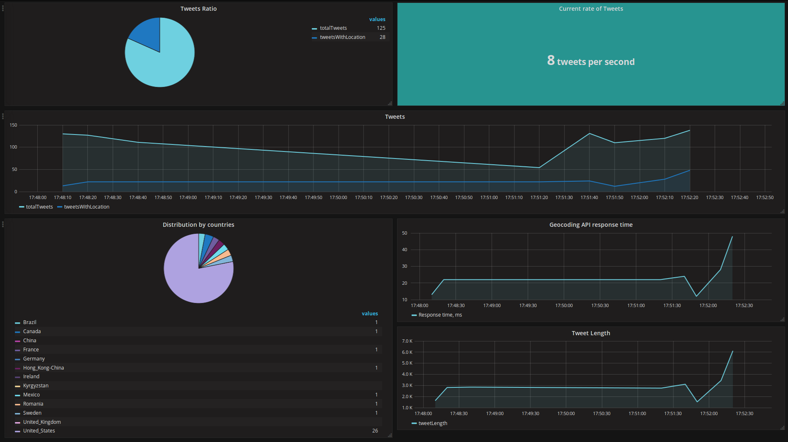

# tweets-fetcher - demo app to demonstrate sending of custom metrics by using statsd

This app provides simple web UI with map. You can type a word for querying twitter and then you will see matched tweets on the map.
In addition to this behaviour, this app sends internal metrics to statsd while working.

## Deploy

Take [manifest.yml](ci/manifest/manifest.yml) set the following env vars in it:
```
BING_MAPS_KEY: xxx
GOOGLE_MAPS_KEY: xxx
TWITTER_CONSUMER_ACCESS_SECRET: xxx
TWITTER_CONSUMER_ACCESS_TOKEN: xxx
TWITTER_CONSUMER_KEY: xxx
TWITTER_CONSUMER_SECRET: xxx
```

For statsd metrics you should create UPS in your org/space and set name of this UPS in [manifest.yml](ci/manifest/manifest.yml) (in `services` block).

Then just `cf push` this app!

## Grafana dashboard

[Here](grafana-dashboard/Tweets-fetcher-dashboard.json).

Screenshot:
.

## Running tests

```
./bin/test
```

## CI

[There is concourse pipeline!](https://concourse.altoros.com/teams/main/pipelines/cf-tweets-fetcher-app?groups=cf-tweets-fetcher-app)
